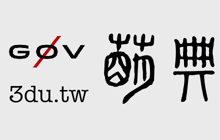

# 萌典 Chrome Extension

[連結](https://chrome.google.com/webstore/detail/%E8%90%8C%E5%85%B8-moedict/aihifbidnaepclhnfppjnpbmeonhhloa)

是否常常看到不認識的中文字，想知道字義、詞意、發音等資訊嗎？
請問「六麤三細」要怎麼念？「麤」又是什麼意思呢？
萌典擴充套件可以讓你輕鬆地用滑鼠選擇字詞後，跳出字詞的詞義與發音等資訊。

*簡體網站也可使用

## 操作說明

使用滑鼠雙擊或反白選擇任何頁面上想查詢的字詞，就會跳出來自萌典網站的字詞搜尋結果。

搜尋結果內的解釋文字，都已連結到萌典網站上的該詞的釋義頁面，點擊即可前往網站觀看。

點擊搜尋結果以外的任何地方，即可關閉搜尋結果的方框。

## Change Log

###### v1.0.2

加入簡轉繁，讓簡體網站也可使用。

###### v1.0.1

修正搜尋結果框內，不會再觸發搜尋萌典。

=================

本專案為 MIT License

擴充套件的上架，特別致謝 @audreyt, Beer Lee, Gary Lai, Japie Wu, @miau715, @ronnywang, tkirby, @zhusee2